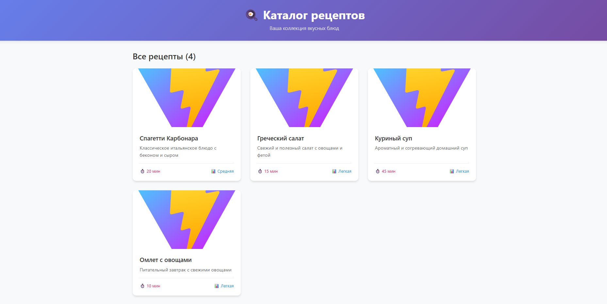
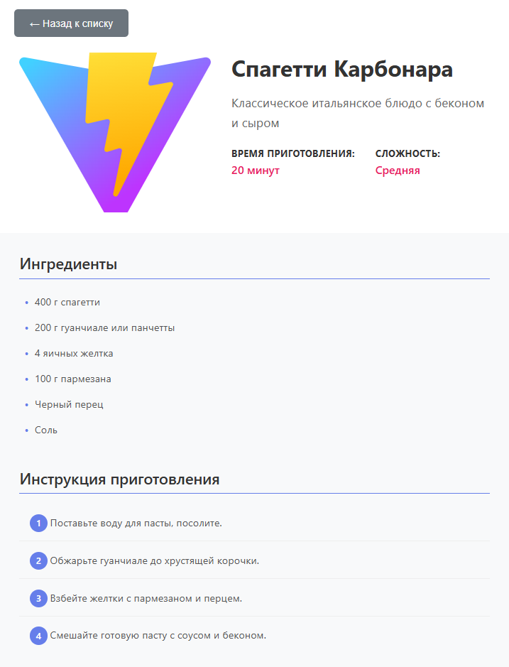

# Каталог рецептов 🍳

React-приложение для хранения и просмотра кулинарных рецептов с красивым и удобным интерфейсом.

## 📋 Оглавление

- [О проекте](#-о-проекте)
- [Функциональности](#-функциональности)
- [Установка и запуск](#-установка-и-запуск)
- [Структура проекта](#-структура-проекта)
- [Скриншоты](#-скриншоты)
- [Особенности реализации](#-особенности-реализации)
- [Вывод](#-вывод)
- [Разработчик](#разработчик)

## 🎯 О проекте

Каталог рецептов — это современное веб-приложение, созданное на React с использованием Vite. Приложение позволяет пользователям просматривать коллекцию рецептов, изучать ингредиенты и пошаговые инструкции приготовления блюд.

## ✨ Функциональности

- **📖 Просмотр списка рецептов** - Удобная сетка карточек с рецептами
- **🔍 Краткое описание** - Каждая карточка содержит название, изображение и краткое описание блюда
- **📄 Детальный просмотр** - Полная информация о рецепте с ингредиентами и инструкциями
- **📱 Адаптивный дизайн** - Корректное отображение на всех устройствах
- **🎨 Современный UI** - Красивый и интуитивно понятный интерфейс
- **⚡ Быстрая загрузка** - Оптимизированная производительность благодаря Vite


## 🚀 Установка и запуск

### Предварительные требования

- Node.js (версия 14 или выше)
- npm или yarn

### Инструкция по установке

1. **Клонируйте репозиторий**

```bash
- git clone <URL-репозитория>
- cd vite-project
- npm install
- npm run dev
- http://localhost:5173
```

## 📁 Структура проекта

```
vite-project/
├── public/                 # Статические файлы
│   └── vite.svg
├── src/
│   ├── assets/            # Ресурсы приложения
│   │   └── react.svg
│   ├── components/        # React-компоненты
│   │   ├── RecipeCard/   # Компонент карточки рецепта
│   │   ├── RecipeDetail/ # Компонент детального просмотра
│   │   └── RecipeList/   # Компонент списка рецептов
│   ├── data/             # Локальные данные
│   │   └── recipes.json  # База рецептов
│   ├── App.jsx           # Главный компонент
│   ├── App.css           # Стили главного компонента
│   ├── main.jsx          # Точка входа
│   └── index.css         # Глобальные стили
├── index.html            # HTML шаблон
├── package.json          # Зависимости и скрипты
└── vite.config.js        # Конфигурация Vite
```

## 📸 Скриншоты

### Главная страница со списком рецептов



### Cтраница рецепта



## 💡 Особенности реализации

###  Архитектура приложения

- Компонентный подход - Каждый компонент отвечает за свою функциональность

### Пользовательский интерфейс

- CSS Grid и Flexbox - Современные методы верстки

###  Адаптивность

- Mobile-first подход - Приоритет разработки для мобильных устройств

## 📄 Вывод

- Было изучено React, Vite, Адаптивная верстка, Json

- Проект "Каталог рецептов" успешно завершен и демонстрирует уверенное владение современными подходами к React-разработке. Все поставленные задачи выполнены в полном объеме, код соответствует лучшим практикам, приложение готово к использованию и дальнейшему развитию

## Разработчик

Студент Мирэа - Тищенко Данил Романович